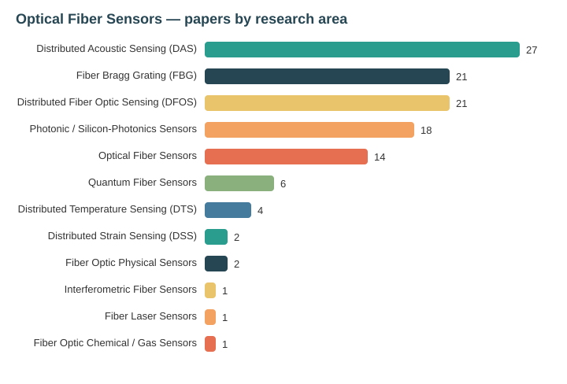

# 🧭 Trend Analysis — 2026-07-24
# 🧭 تحلیل روند — ۲۰۲۶-۰۷-۲۴

> Companion analysis to [`../Reports/2026-07-24.md`](../Reports/2026-07-24.md).
> Derived from the 10 papers logged on this date (2 off-topic search
> false-positives were dropped: a derivative-free-optimization paper and a
> 2015 DTS review that violated the recency criterion).

## Distribution by research area / توزیع بر پایه حوزه پژوهشی

| Research area / حوزه | Papers | Share |
|---|---:|---:|
| Distributed Acoustic Sensing (DAS) | 5 | 50% |
| Fiber Bragg Grating (FBG) | 2 | 20% |
| Photonic / Silicon-Photonics Sensors | 2 | 20% |
| Distributed Fiber Optic Sensing (DFOS) | 1 | 10% |

## The one-line thesis / تز یک‌خطی

**EN —** DAS dominates by volume, but its frontier has moved from *acquisition* to
*waveform engineering, passive ambient-field imaging, and native strain-rate
computation*. Meanwhile fiber sensing reaches down to the single molecule
(silicon-photonic protein dynamics) and out to the body (wearable DOFS), and AI
now lives inside the read-out (self-supervised fault tolerance, in-optics event
detection) — not just in post-analysis.

**FA —** DAS از نظرِ حجم غالب است، اما مرزِ آن از «برداشت» به «مهندسیِ شکل‌موج،
تصویربرداریِ غیرفعال از میدانِ محیطی و محاسباتِ بومیِ نرخ‌کرنش» جابه‌جا شده است.
هم‌زمان حسگریِ فیبری تا تک‌مولکول (دینامیکِ پروتئینِ سیلیکون‌فوتونیک) و تا بدن
(DOFSِ پوشیدنی) گسترده می‌شود و هوشِ مصنوعی اکنون درونِ بازخوانی جای دارد.

## Maturity map / نقشه بلوغ

| Stage / مرحله | Papers |
|---|---|
| Capability breakthrough | Single-protein silicon-photonic sensor (`2607.15925`) |
| Application-driven system | Deployable DAS vine-robot (`2607.20392`); fault-tolerant FBG surgery (`2606.18628`); wearable DOFS mat (`2607.11255`) |
| Method / signal engineering | CP-free OFDM DAS (`2607.18687`); microring in-optics detection (`2606.11940`); SHM fusion (`2607.02545`) |
| Field demonstration | Passive Scholte-wave seabed imaging (`2607.16157`) |
| Computational infrastructure | DAS strain-rate wave equation (`2607.09380`); native-DAS joint FWI (`2607.01649`) |

## Comparison with 2026-07-23 / مقایسه با روز قبل

- Yesterday: 6 papers, first digest, theme = *distributed + quantum sensing × ML*.
- Today: 10 papers, DAS-heavy, theme = *systems, waveforms, and AI inside the read-out*.
- Net: **+4** papers; DAS share rose sharply (from 33% to 50%); a new **biomedical /
  single-molecule** thread appeared that was absent yesterday.

## Watch-list / فهرست پایش

- Peer-reviewed versions of the July-2026 (`2607.*`) preprints.
- Field validation of deployable DAS arrays and CP-free OFDM interrogation.
- Throughput scaling of the single-protein photonic sensor.
- Clinical validation of fault-tolerant FBG force sensing and wearable DOFS.

---
_This file is regenerated per report date; historical versions are preserved by date._
